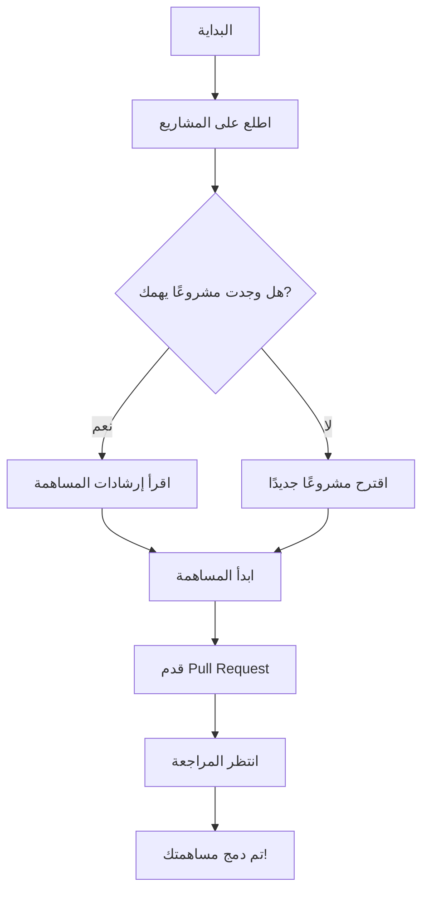

# 🌟 مستودع مشاريع مجتمع مطوري جافا بالعربي 🌟

[🏠 الرئيسية](#-مستودع-مشاريع-مجتمع-مطوري-جافا-بالعربي-) | 
[👥 نظرة عامة](#-نظرة-عامة-على-المستودع) | 
[📂 هيكل المستودع](#-هيكل-المستودع) | 
[🤝 كيفية المساهمة](#-كيفية-المساهمة) | 
[📝 إرشادات المساهمة](#-إرشادات-المساهمة) | 
[👀 مراجعة الكود](#-عملية-مراجعة-الكود) | 
[💡 أفكار للمشاريع](#-أفكار-للمشاريع) | 
[🆘 الدعم والمساعدة](#-الدعم-والمساعدة)

---

## 👥 نظرة عامة على المستودع

مرحبًا بك في مستودع المشاريع الخاص بمجتمع مطوري جافا بالعربي! هذا المكان هو مركز لجميع المشاريع التي يعمل عليها أعضاء مجتمعنا. نحن نشجع المساهمات من جميع المستويات، من المبتدئين إلى الخبراء. هدفنا هو توفير منصة للتعلم والتعاون وتبادل الخبرات في مجال تطوير Java.

## 📂 هيكل المستودع

المستودع منظم في أربعة مجلدات رئيسية حسب مستوى الصعوبة:

1. **/beginner**: مشاريع للمبتدئين في Java.
2. **/intermediate**: مشاريع لمتوسطي المستوى.
3. **/advanced**: مشاريع متقدمة للمطورين ذوي الخبرة.
4. **/challenges**: تحديات برمجية قصيرة ومسابقات.

كل مشروع له مجلده الخاص داخل المجلد المناسب لمستواه.

## 🤝 كيفية المساهمة

نرحب بمشاركتك الفعالة في المجتمع! إليك بعض الطرق للمساهمة:

1. 🐞 **حل المشكلات**: ابحث عن الـ Issues المفتوحة وساهم في حلها.
2. 💻 **اقتراح تحسينات**: قدم Pull Requests لتحسين الكود أو الوثائق.
3. 💬 **شارك في النقاشات**: انضم إلى محادثاتنا في قسم Discussions.
4. 📝 **شارك معرفتك**: اكتب مقالات أو دروس تعليمية للمجتمع.
5. 🙋 **ساعد الآخرين**: أجب على أسئلة المبتدئين وشارك خبراتك.

للبدء، اتبع هذه الخطوات:

## 📝 إرشادات المساهمة

- اكتب كودًا نظيفًا ومقروءًا مع التعليقات المناسبة.
- اتبع معايير تسمية Java المتعارف عليها.
- قم بتوثيق مشروعك جيدًا في ملف README.md داخل مجلد المشروع.
- تأكد من أن مشروعك يعمل بشكل صحيح قبل تقديم pull request.
- أضف اختبارات وحدة (unit tests) إن أمكن.

## 👀 عملية مراجعة الكود

1. سيقوم أحد المراجعين بفحص pull request الخاص بك.
2. قد يطلب المراجع تغييرات أو توضيحات.
3. قم بإجراء التغييرات المطلوبة وتحديث pull request.
4. بمجرد الموافقة، سيتم دمج مساهمتك في المشروع.

## 💡 أفكار للمشاريع

إذا كنت تبحث عن أفكار لمشاريع جديدة، إليك بعض الاقتراحات:

- تطبيق إدارة المهام باستخدام واجهة مستخدم رسومية
- محرك لعبة بسيط
- أداة لتحليل البيانات وعرضها بيانيًا
- تطبيق ويب باستخدام Spring Boot
- برنامج محاكاة لنظام بنكي

## 🆘 الدعم والمساعدة

إذا واجهت أي صعوبات أو كانت لديك أسئلة:

- راجع [الأسئلة الشائعة](FAQ.md) (إذا كان موجودًا).
- افتح issue للحصول على المساعدة.
- تواصل مع المجتمع عبر [قنوات التواصل الرسمية](https://github.com/u4java/community#-تواصل-معنا).

---

### 💖 شكر خاص لجميع المساهمين والداعمين لمجتمعنا! 💖

🌟 معًا نبني مستقبل أفضل لتطوير Java في العالم العربي! 🌟

[قواعد السلوك](https://github.com/u4java/u4java/blob/main/CODE_OF_CONDUCT.md)

