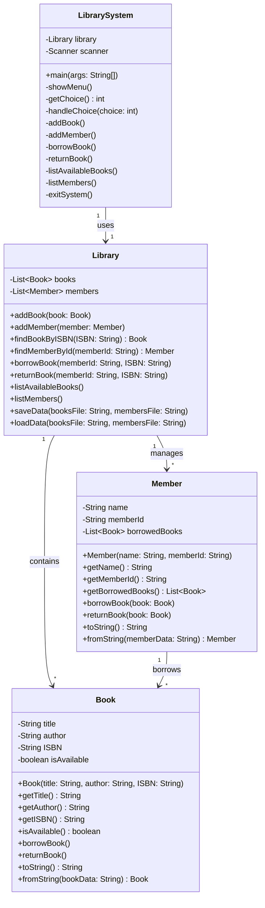

# نظام إدارة المكتبة

هذا المشروع هو نظام إدارة مكتبة بسيط مطبق بلغة Java باستخدام مبادئ البرمجة الكائنية (OOP). يتيح النظام للمستخدمين إضافة الكتب والأعضاء، استعارة الكتب وإعادتها، وعرض الكتب والأعضاء المتاحين.

## الميزات

- إضافة كتب جديدة إلى المكتبة
- إضافة أعضاء جدد إلى المكتبة
- استعارة الكتب
- إرجاع الكتب
- عرض الكتب المتاحة
- عرض أعضاء المكتبة

## الفئات

### Book (كتاب)
تمثل كتابًا في المكتبة.

#### الخصائص
- `title`: عنوان الكتاب
- `author`: مؤلف الكتاب
- `ISBN`: الرقم الدولي المعياري للكتاب
- `isAvailable`: حالة توفر الكتاب

#### الدوال
- `borrowBook()`: وضع علامة على الكتاب كتم استعارته
- `returnBook()`: وضع علامة على الكتاب كمتاح
- `toString()`: يعيد تمثيل الكتاب كسلسلة نصية
- `fromString(String bookData)`: ينشئ كائن Book من سلسلة نصية

### Member (عضو)
تمثل عضوًا في المكتبة.

#### الخصائص
- `name`: اسم العضو
- `memberId`: معرف العضو
- `borrowedBooks`: قائمة الكتب المستعارة من قبل العضو

#### الدوال
- `borrowBook(Book book)`: يستعير كتابًا
- `returnBook(Book book)`: يعيد كتابًا مستعارًا
- `toString()`: يعيد تمثيل العضو كسلسلة نصية
- `fromString(String memberData)`: ينشئ كائن Member من سلسلة نصية

### Library (مكتبة)
تدير الكتب والأعضاء في المكتبة.

#### الخصائص
- `books`: قائمة الكتب في المكتبة
- `members`: قائمة الأعضاء في المكتبة

#### الدوال
- `addBook(Book book)`: يضيف كتابًا جديدًا إلى المكتبة
- `addMember(Member member)`: يضيف عضوًا جديدًا إلى المكتبة
- `findBookByISBN(String ISBN)`: يجد كتابًا بواسطة الرقم الدولي المعياري
- `findMemberById(String memberId)`: يجد عضوًا بواسطة معرفه
- `borrowBook(String memberId, String ISBN)`: يتيح لعضو استعارة كتاب
- `returnBook(String memberId, String ISBN)`: يتيح لعضو إرجاع كتاب مستعار
- `listAvailableBooks()`: يعرض جميع الكتب المتاحة
- `listMembers()`: يعرض جميع الأعضاء
- `saveData(String booksFile, String membersFile)`: يحفظ بيانات المكتبة إلى ملفات
- `loadData(String booksFile, String membersFile)`: يحمل بيانات المكتبة من ملفات

### LibrarySystem (نظام المكتبة)
يحتوي على الدالة الرئيسية للتفاعل مع نظام المكتبة.

#### الدوال
- `showMenu()`: يعرض خيارات القائمة
- `getChoice()`: يحصل على اختيار المستخدم
- `handleChoice(int choice)`: يعالج اختيار المستخدم
- `addBook()`: يضيف كتابًا جديدًا
- `addMember()`: يضيف عضوًا جديدًا
- `borrowBook()`: يستعير كتابًا
- `returnBook()`: يعيد كتابًا
- `listAvailableBooks()`: يعرض الكتب المتاحة
- `listMembers()`: يعرض الأعضاء
- `exitSystem()`: يخرج من النظام ويحفظ البيانات

## كيفية الاستخدام

1. قم بتجميع وتشغيل الفئة `LibrarySystem`.
2. اتبع خيارات القائمة للتفاعل مع نظام المكتبة:
   - إضافة الكتب والأعضاء
   - استعارة وإعادة الكتب
   - عرض الكتب المتاحة والأعضاء
3. اختر خيار "Exit" لحفظ البيانات والخروج من النظام.

## هيكل الملفات

- `books.txt`: يخزن بيانات الكتب
- `members.txt`: يخزن بيانات الأعضاء

## المتطلبات

- حزمة تطوير Java (JDK) 8 أو أعلى

## Class uml

## الرخصة

هذا المشروع مرخص تحت رخصة (CC BY-NC 4.0).

